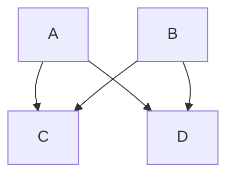
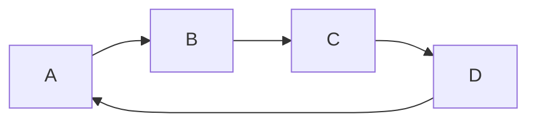
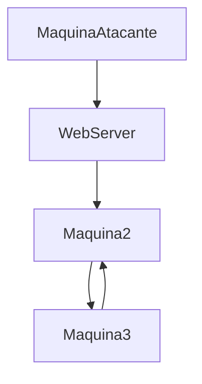
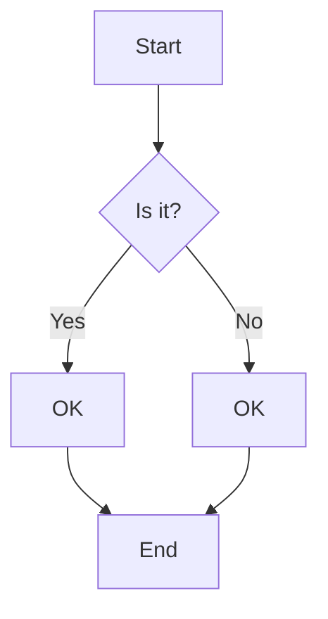
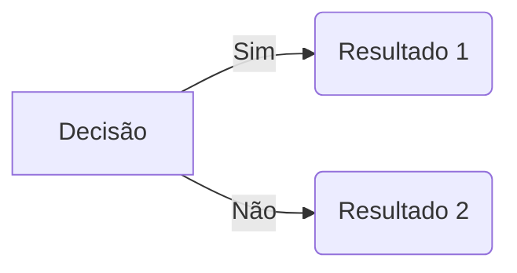
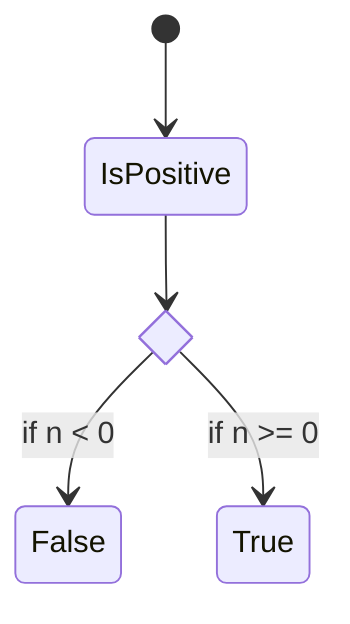
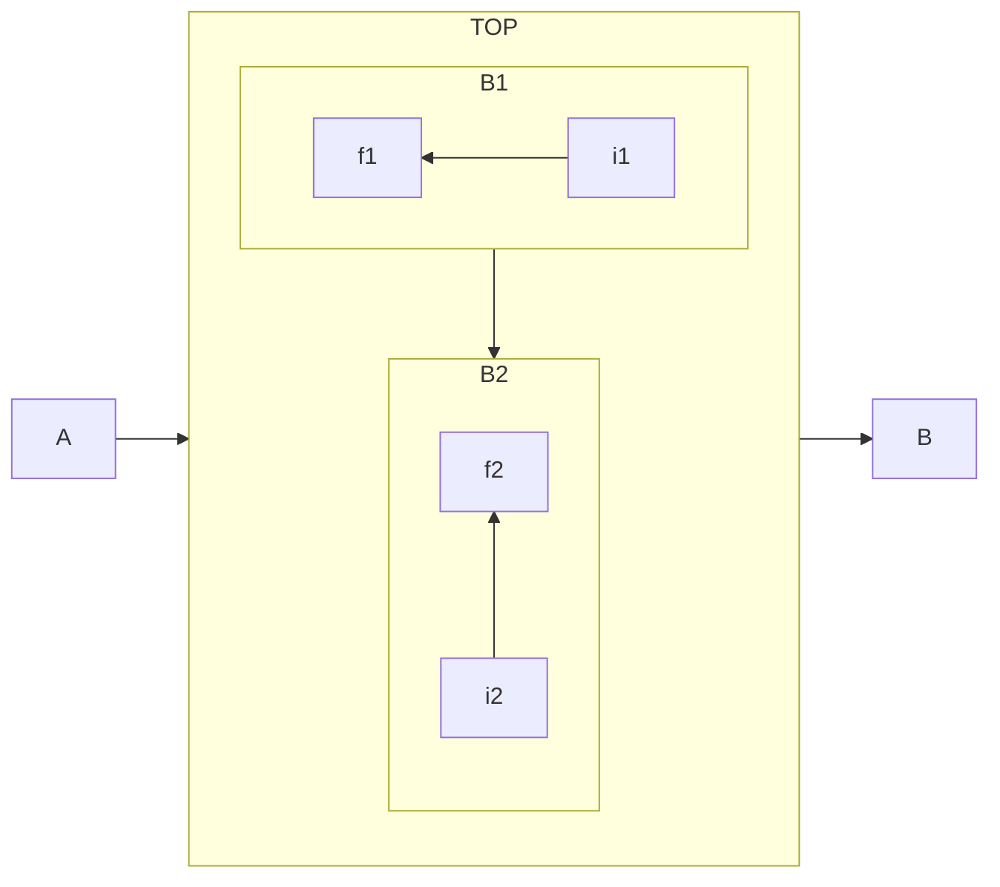
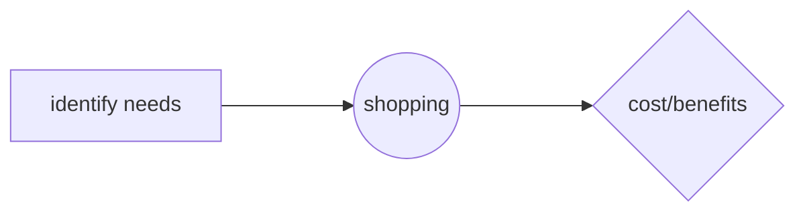
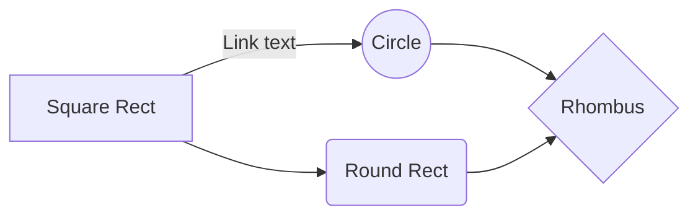
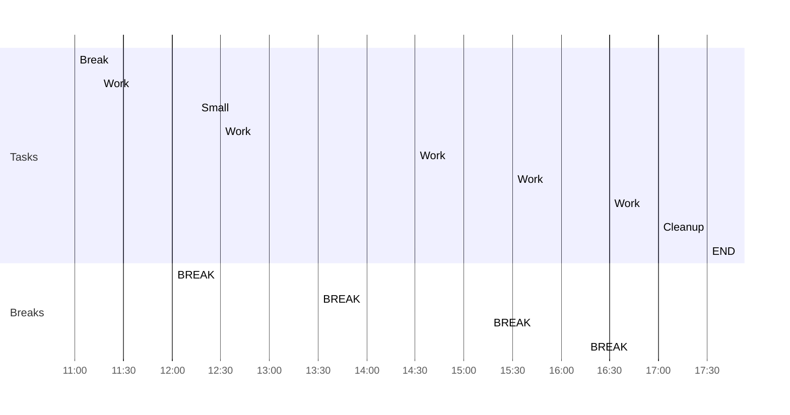

![[Markdown_image_1.png|1125x375]]
#ObsidianCheatCheet 

___

## CheatSheet Principal

Palavras importantes: O ataque **EvilTwin** consiste em criar um Rogue AP.
Citação de ferramentas: Agora abra o `Wireshark` para que possamos capturar pacotes na rede.
Comandos: Pressione **`CTRL+F`** 

___
___
____

## Títulos

# Título Nível 1
## Título Nível 2
### Título Nível 3
#### Título Nível 4
##### Título Nível 5

outra forma

TITULO 1
============

TITULO 2
---

### TITULO 3
___

```
# Título Nível 1
## Título Nível 2
### Título Nível 3
#### Título Nível 4
##### Título Nível 5

outra forma

TITULO 1
============

TITULO 2
----------------
```


`teste`

```python
print teste
```


## Régua
***

```
___

OU

***
```

## Notas de rodapé

#markdown #obsidian #SQLi


```
#markdown #obsidian
```


## Vinculando os cabeçalhos

[[wikilink#]] 

```
[[wikilink#]]
```


## Bloco de citação


Referências:
>www.google.com

```
> Referências: www.google.com
```

## Marcadores e Numeradores

1. Primeiro item
2. Segundo Item
3. Terceiro Item

1) Primeiro Item
2) Segundo Item
3) Terceiro Item

- Primeiro Item
- Segundo Item
- Terceiro Item

```
1. Primeiro item
2. Segundo Item
3. Terceiro Item

1) Primeiro Item
2) Segundo Item
3) Terceiro Item

- Primeiro Item
- Segundo Item
- Terceiro Item
```

Seta
->
---> 
-----> 
=>
==>
```
->
---> 
-----> 
=>
==>
```


~~Tarefa Finalizada~~

```
~~Tarefa Finalizada~~
```

%% Comentários %%

```
%% Comentários %%
```

==Item a ser visualizado facilmente==

```
==Item a ser visualizado facilmente==
```


## Checkbox

- [ ] Checkbox Vazio
- [s] Checkbox Confirmado
- [x] Checkbox Tarefa Finalizada

```
- [ ] Checkbox Vazio
- [s] Checkbox Confirmado
- [x] Checkbox Tarefa Finalizada
```


## Bloco de código

```
Código
```

```
Três acentos graves ```
Código
Três acentos graves ```
```


## Formatações de texto

*texto em itálico*
_texto2 em itálico_

**texto em negrito**
__texto2 em negrito__

```
*texto em itálico*
_texto2 em itálico_

**texto em negrito**
__texto2 em negrito__
```


## Links

[google](www.google.com)
[texto do link](Url do link)
Link de Imagem

```
[google](www.google.com)
[texto do link](Url do link)
 Link de Imagem
```


## Mensagem de Atenção (callouts)

> [!info]- INFORMAÇÕES
Aqui passarei algumas informações relevantes.

> [!notes]- NOTA
Aqui passarei algumas informações relevantes.

>[!tip]- IMPORTANTE
Aqui posso descrever pontos que podem fazer toda a diferença.

>[!CAUTION]- ATENÇÃO!
Aqui posso informar algo que possa dar errado.

>[!fail]- FALHA
>Aqui eu posso documentar erros.

>[!bug]- CVE-000-000-000
>Aqui posso reportar bugs,  CVEs, Vulnerabilidades ou Exploits.

```
> [!info]- INFORMAÇÕES
Aqui passarei algumas informações relevantes.

> [!notes]- NOTA
Aqui passarei algumas informações relevantes.

>[!tip]- IMPORTANTE
Aqui posso descrever pontos que podem fazer toda a diferença.

>[!CAUTION]- PERIGO!
Aqui posso informar algo que possa dar errado.

>[!fail]- FALHA
>Aqui eu posso documentar erros.

>[!bug]- CVE-000-000-000
>Aqui posso reportar bugs,  CVEs, Vulnerabilidades ou Exploits.
```

___

> [!success] Success, Check, Done

> [!warning]- Warning, Caution, Attention

> [!example]- Example

> [!quote]- Quote, Cite  

> [!abstract]- Abstract, Summary, Tldr
> Lorem ipsum dolor sit amet

> [!question]- Question, Help, FAQ
> Lorem ipsum dolor sit amet

> [!danger]- Danger, Error
> Lorem ipsum dolor sit amet

> [!todo]-
> Lorem ipsum dolor sit amet

> [!important]- Tip, Hint, Important
> - Redes sociais  
> - Aplicativos
> - Comunicação global instantânea  
>>>[!example] **Defesa**
>>> - Cibersegurança  
>>> - Vigilância inteligente  
>>> - Proteção avançada de dados  

> [!failure] Failure, Fail, Missing

> [!note]

> [!info] Info, Todo

> [!bug] Bug, CVE

___
## Tabelas

| Título 1 | Título 2 | Título 3 |
| -------- | -------- | -------- |
| Item 1   | Item 2   | Item 3   |
| - [x]    | - [ ]    | - [x]    |

```
| Título 1 | Título 2 | Título 3 |
| --- | --- | --- |
| Item 1 | Item 2 | Item 3 |
| - [x] | - [ ] | - [x] |
```

> [!note] Conexão com internet necessária?
> _________
>| Classroom | iLabs | 
>| --- | --- |
>| ------------ | [ -X- ] |

```
> [!note] Conexão com internet necessária?
> _________
>| Classroom | iLabs | 
>| --- | --- |
>| ------------ | [ -X- ] |
```

> [!note] Plataforma suportada?
> _________
> | Sim | Não | 
| --- | --- |
| [ V ] | [ V ] |

```
> [!note] Plataforma suportada?
> _________
> | Sim | Não | 
| --- | --- |
| [ V ] | [ V ] |
```

Alinhamento de conteúdo nas tabelas
| Título 1 | Título 2 | Título 3 |
| :--- | :---: | ---: |
| Item 1 | Item 2 | Item 3 |
| - [x] | - [ ] | - [x] |

```
| Título 1 | Título 2 | Título 3 |
| :--- | :---: | :---: |
| Item 1 | Item 2 | Item 3 |
| - [x] | - [ ] | - [x] |
```

___

>[!info]- EWT
>O que é ETW?
>**ETW** significa **Event Tracing for Windows**.
>
É uma **infraestrutura nativa do Windows** usada para:
>
>- Coletar eventos de sistema **em tempo real**
>- Registrar atividades de:
  >  - Processos
    - Threads
    - PowerShell
    - .NET
    - Kernel
    - Segurança
>- Alimentar:
    - Event Viewer
    - EDRs
    - SIEMs
    - Ferramentas forenses
>
👉 Em resumo:  
**ETW é um dos principais mecanismos que permitem ao Blue Team “ver” o que está acontecendo no sistema.**

___


>[!Versão 1.1]
># teste
Que truque legal
Eu não sabia que dava para fazer isso
> ### teste
com certeza da
>### teste 2


## Colorindo linhas

<pre>                                                                                                                   
<font color="#5EBDAB">┌──(</font><font color="#277FFF"><b>amaraisantos㉿kali</b></font><font color="#5EBDAB">)-[</font><b>/meuprojeto</b><font color="#5EBDAB">]</font>
<font color="#5EBDAB">└─</font><font color="#277FFF"><b>$</b></font> <font color="#49AEE6">tree</font>     
<font color="#277FFF"><b>.</b></font>
├── <font color="#277FFF"><b>doc</b></font>
│   ├── <font color="#277FFF"><b>logs</b></font>
│   └── <font color="#277FFF"><b>screenshots</b></font>
├── <font color="#277FFF"><b>enum</b></font>
│   └── <font color="#277FFF"><b>alvos.txt</b></font>
├── <font color="#277FFF"><b>lost+found</b></font>
└── <font color="#277FFF"><b>serviços</b></font>
</pre>


## Mermaid (Diagramas)

Encontrei pelo nome de 'mermaid'




\`\`\` mermaid
flowchart TB  
	A --> C  
	A --> D  
	B --> C  
	B --> D
\`\`\`





\`\`\` mermaid
flowchart LR 
	A --> B  
	B --> C  
	C --> D  
	D --> A
\`\`\`





\`\`\`mermaid
flowchart TB  
	Atacante --> WebServer
	WebServer --> Maquina2
	Maquina2 --> Maquina3 
	Maquina3 --> Maquina2
\`\`\`




\`\`\`mermaid
graph TD
    A[Start] --> B{Is it?};
    B -- Yes --> C[OK];
    B -- No --> D[OK];
    C --> E[End];
    D --> E;
\`\`\`




\`\`\`mermaid
graph LR
A[Decisão] -->|Sim| B(Resultado 1) 
A --> |Não| C(Resultado 2)
\`\`\`




\`\`\`mermaid
stateDiagram-v2
    state if_state <\<choice>>
    [\*] --> IsPositive
    IsPositive --> if_state
    if_state --> False: if n < 0
    if_state --> True : if n >= 0
\`\`\`




\`\`\`mermaid
flowchart LR
  subgraph TOP
    direction TB
    subgraph B1
        direction RL
        i1 -->f1
    end
    subgraph B2
        direction BT
        i2 -->f2
    end
  end
  A --> TOP --> B
  B1 --> B2
\`\`\`





\`\`\`mermaid
flowchart LR
A[identify needs] ---> B((shopping)) ---> C{ cost/benefits}
\`\`\`




\`\`\`mermaid
graph LR
A[Square Rect] -- Link text --> B((Circle))
A --> C(Round Rect)
B --> D{Rhombus}
C --> D 
\`\`\`
___

### Mermaid - Gannt Diagram

OBS: Este não está marcando as cores corretamente. Pesquisar:
Fonte: https://forum.obsidian.md/t/mermaid-gantt-diagrams-are-slighly-wider-than-pane/8500


___

Teste Mermaid OSCP

___
___
## Imagens

Inserindo imagens e informando a resolução. Altura vs largura
![[Markdown_image_1.png|1125x375]]

```
![[Markdown_image_1.png|1000x350]]
```

### Links internos de notas

```
[[#Preview a linked file]]

[[2023-01-01#^37066d]]

[[Obsidian#Links are first-class citizens]]

[[Example#Details|Section name]]
```

___
### Outros sites para observar a configuração do Markdown

https://docs.pipz.com/central-de-ajuda/learning-center/guia-basico-de-markdown#open
